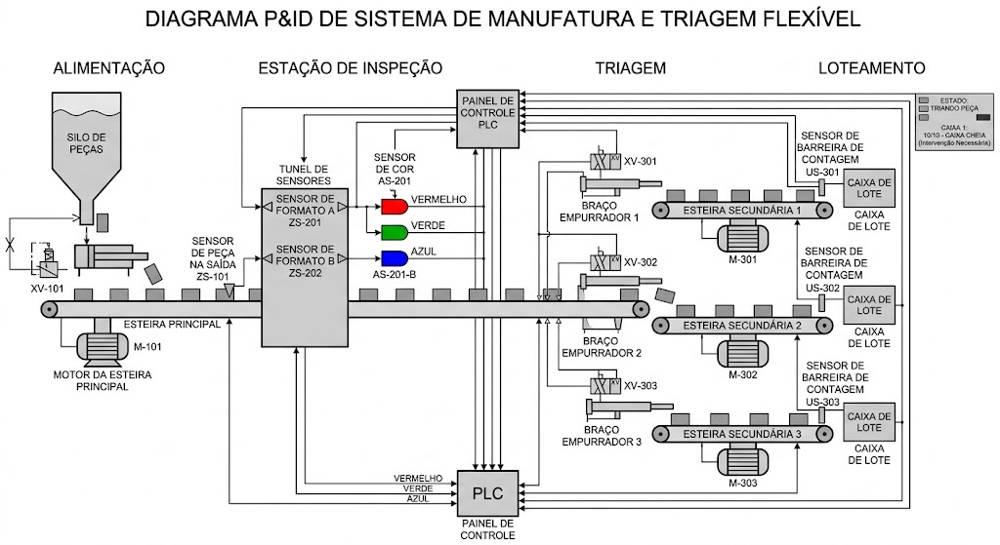

# Mapeamento de Variáveis de Processo para Proposições Lógicas: Sistema de Manufatura Flexível

Na automação industrial (norma ISA-5.1), instrumentos e atuadores emitem e recebem sinais discretos (binários: $0$ = Falso / $1$ = Verdadeiro). Este documento detalha a arquitetura de controle e o mapeamento de I/O para a planta de manufatura flexível.

Abaixo, as variáveis da planta de manufatura são discretizadas em proposições lógicas:

## Setor 100: Alimentação e Transporte Principal

| Tag Instrumento | Tipo de Dispositivo | Variável Física | Proposição Lógica | Estado 1 |
| :--- | :--- | :--- | :---: | :--- |
| **LS-101** | Chave de Nível | Silo de Peças | $l_{silo}$ | Silo de peças VAZIO (nível baixo) |
| **ZS-101** | Sensor de Posição | Presença Peça | $s_{feed}$ | Peça detectada na saída do alimentador |
| **XV-101** | Válvula Solenoide | Pistão de Alimentação | $v_{feed}$ | Pistão acionado (AVANÇADO) |
| **M-101** | Contator do Motor | Esteira Principal | $m_1$ | Motor da esteira principal LIGADO |
| **HS-101** | Botão/Comando | Partida do Sistema | $cmd_{start}$ | Comando de START acionado |

---

## Setor 200: Estação de Inspeção e Triagem (Classificação)

| Tag Instrumento | Tipo de Dispositivo | Variável Física | Proposição Lógica | Estado 1 |
| :--- | :--- | :--- | :---: | :--- |
| **ZS-201** | Sensor Óptico | Formato Peça A | $s_a$ | Sensor A detecta peça |
| **ZS-202** | Sensor Óptico | Formato Peça B | $s_b$ | Sensor B detecta peça |
| **AS-201** | Detector Cor | Cor Vermelho | $c_r$ | Peça detectada como VERMELHA |
| **AS-202** | Detector Cor | Cor Verde | $c_g$ | Peça detectada como VERDE |
| **AS-203** | Detector Cor | Cor Azul | $c_b$ | Peça detectada como AZUL |
| **XV-201** | Válvula Solenoide | Braço Triagem 1 | $v_1$ | Braço 1 acionado (EMPURRANDO) |
| **XV-202** | Válvula Solenoide | Braço Triagem 2 | $v_2$ | Braço 2 acionado (EMPURRANDO) |
| **XV-203** | Válvula Solenoide | Braço Triagem 3 | $v_3$ | Braço 3 acionado (EMPURRANDO) |

---

## Setor 300: Loteamento, Segurança e Supervisão

| Tag Instrumento | Tipo de Dispositivo | Variável Física | Proposição Lógica | Estado 1 |
| :--- | :--- | :--- | :---: | :--- |
| **US-301** | Sensor Contagem | Saída Caixa 1 | $cnt_1$ | Pulso de contagem detectado na saída 1 |
| **US-302** | Sensor Contagem | Saída Caixa 2 | $cnt_2$ | Pulso de contagem detectado na saída 2 |
| **US-303** | Sensor Contagem | Saída Caixa 3 | $cnt_3$ | Pulso de contagem detectado na saída 3 |
| **M-301** | Contator do Motor | Esteira Secundária 1 | $m_{301}$ | Motor da esteira 1 LIGADO |
| **M-302** | Contator do Motor | Esteira Secundária 2 | $m_{302}$ | Motor da esteira 2 LIGADO |
| **M-303** | Contator do Motor | Esteira Secundária 3 | $m_{303}$ | Motor da esteira 3 LIGADO |
| **HS-301** | Botão Emergência | Segurança Manual | $e_1$ | Parada de emergência (E-STOP) acionada |
| **HS-302** | Sinaleiro/Stack | Alarme de Produção | $a_1$ | Sistema em estado de FALHA/ALERTA |
