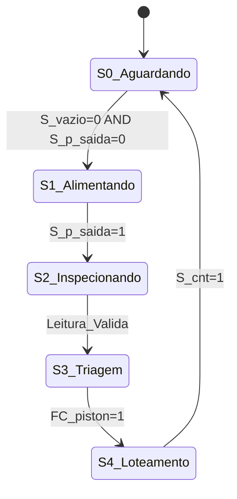

# Projeto SCADA: Linha de Triagem e Loteamento Inteligente
**Disciplina:** Matemática Discreta  
**Aplicação:** Automação Industrial e Sistemas Supervisórios  

---

## 1. Descrição Geral da Planta de Manufatura

O sistema consiste em uma linha de triagem e loteamento inteligente de peças mistas recebidas em uma esteira principal. A planta realiza o sensoriamento, a inspeção de formato e cor, a triagem via atuadores pneumáticos e a contagem de peças em caixas para formação de lotes (batches) de expedição.

---

## 2. Mapeamento de Variáveis Discretas (Tags do SCADA)

### 2.1. Entradas Discretas (Sensores do SCADA)
* **Alimentador:**
  * `S_vazio`: Sensor de Silo Vazio ($1 =$ Vazio, $0 =$ Com peças)
  * `S_p_saida`: Sensor de Peça na Saída da Alimentação
* **Esteira Principal:**
  * `S_emerg`: Botão de Emergência ($0 =$ Pressionado / Contato NF, $1 =$ Operação Normal)
  * `S_sobrecarga`: Sensor de Sobrecarga Thermal/Elétrica do Motor ($1 =$ Falha)
* **Inspeção:**
  * `A`: Sensor de Formato Inferior / Base
  * `B`: Sensor de Formato Superior / Topo
  * `C_R`: Sensor Óptico de Cor - Canal Vermelho
  * `C_G`: Sensor Óptico de Cor - Canal Verde
  * `C_B`: Sensor Óptico de Cor - Canal Azul
* **Triagem:**
  * `FC_p1`: Sensor Fim de Curso do Pistão Empurrador 1
  * `FC_p2`: Sensor Fim de Curso do Pistão Empurrador 2
  * `FC_p3`: Sensor Fim de Curso do Pistão Empurrador 3
* **Loteamento (Caixas):**
  * `S_cnt1`: Barreira Óptica de Contagem na Saída 1
  * `S_cnt2`: Barreira Óptica de Contagem na Saída 2
  * `S_cnt3`: Barreira Óptica de Contagem na Saída 3

### 2.2. Saídas Discretas (Comandos do SCADA)
* **Alimentador:**
  * `CMD_pist_alim`: Comando Ativar Pistão de Alimentação
* **Esteira Principal:**
  * `CMD_motor`: Comando Ligar Motor da Esteira
* **Triagem:**
  * `CMD_p1`: Comando Avançar Pistão 1
  * `CMD_p2`: Comando Avançar Pistão 2
  * `CMD_p3`: Comando Avançar Pistão 3
* **Loteamento (Caixas):**
  * `ALM_cx1`: Alarme/Indicador de Caixa Cheia 1 (10 peças)
  * `ALM_cx2`: Alarme/Indicador de Caixa Cheia 2 (10 peças)
  * `ALM_cx3`: Alarme/Indicador de Caixa Cheia 3 (10 peças)
  * `RST_cnt1`: Comando de Reset do Contador 1
  * `RST_cnt2`: Comando de Reset do Contador 2
  * `RST_cnt3`: Comando de Reset do Contador 3

---

## 3. Lógica Booleana e Equações de Intertravamento

### 3.1. Classificação de Formato
* **Peça Pequena:** $A \cdot \overline{B} = 1$
* **Peça Grande:** $A \cdot B = 1$
* **Condição Inválida:** $\overline{A} \cdot B = 1$

### 3.2. Lógica de Atuação dos Pistões de Triagem
* **Pistão 1 (Peça Grande e Vermelha):**
  $$CMD_{p1} = (A \cdot B \cdot C_R) \cdot \overline{FC_{p1}}$$
* **Pistão 2 (Peça Grande e Verde):**
  $$CMD_{p2} = (A \cdot B \cdot C_G) \cdot \overline{FC_{p2}}$$
* **Pistão 3 (Peça Pequena e Azul):**
  $$CMD_{p3} = (A \cdot \overline{B} \cdot C_B) \cdot \overline{FC_{p3}}$$

---

## 4. Máquina de Estados Finitos (FSM)

A Máquina de Estados Finitos é definida formalmente pela 6-tupla $M = (Q, \Sigma, \Gamma, \delta, \lambda, S_0)$:

* **$Q$ (Conjunto de Estados):** $\{S_0, S_1, S_2, S_3, S_4\}$
  * $S_0$: Aguardando Peça
  * $S_1$: Alimentando Peça
  * $S_2$: Inspecionando (Leitura dos Sensores)
  * $S_3$: Triagem (Acionamento do Atuador)
  * $S_4$: Loteamento (Contagem de Caixa)
* **$\Sigma$ (Alfabeto de Entrada):** $\{S_{vazio}, S_{p\_saida}, A, B, C_R, C_G, C_B, FC_{p1..3}, S_{cnt1..3}\}$
* **$\Gamma$ (Alfabeto de Saída):** $\{CMD_{motor}, CMD_{pist\_alim}, CMD_{p1..3}, ALM_{cx1..3}\}$
* **$S_0$ (Estado Inicial):** $S_0$

### 4.1. Tabela de Transição de Estados

| Estado Atual ($Q$) | Evento / Entrada ($\Sigma$) | Próximo Estado ($Q'$) | Saída / Ação do SCADA ($\Gamma$) |
| :--- | :--- | :--- | :--- |
| **$S_0$: Aguardando** | $S_{vazio}=0 \land S_{p\_saida}=0$ | $S_1$: Alimentando | $CMD_{motor}=1$ |
| **$S_1$: Alimentando** | $S_{p\_saida}=1$ | $S_2$: Inspecionando | $CMD_{pist\_alim}=1$ |
| **$S_2$: Inspeção** | Sensores de Formato ($A, B$) e Cor ($C_R, C_G, C_B$) | $S_3$: Triagem | *Apenas Leitura* |
| **$S_3$: Triagem** | Seleção de Rota por Tabela Verdade | $S_4$: Loteamento | $CMD_{p1}, CMD_{p2}$ ou $CMD_{p3}=1$ |
| **$S_4$: Loteamento** | $S_{cnt1}, S_{cnt2}$ ou $S_{cnt3}=1$ | $S_0$: Aguardando | Incrementa Contador / $ALM_{cx}$ se $=10$ |

### 4.2. Diagrama de Transição de Estados (Mermaid)

---

## 5. Análise de Contradições e Inconsistências Lógicas

Nesta seção, analisa-se a robustez do sistema SCADA sob a ótica da Matemática Discreta, identificando condições de incerteza, violação de propriedades físicas e indeterminismos de estado.

### 5.1. Contradições de Entrada (Sensores)
* **Inconsistência Geométrica no Formato:** O acionamento do sensor superior sem o inferior ($\overline{A} \cdot B = 1$) representa uma contradição física, indicando falha no sensor $B$ ou peça flutuante/desalinhada.
* **Ambiguidade de Cor:** O acionamento simultâneo de múltiplos sensores de cor ($(C_R \cdot C_G) + (C_R \cdot C_B) + (C_G \cdot C_B) 
eq 0$) gera uma contradição booleana, impedindo a tomada de decisão para a rota de triagem.
* **Incompatibilidade no Silo:** A leitura simultânea de silo vazio e peça na saída ($S_{vazio} \cdot S_{p\_saida} = 1$) indica um erro de sensoriamento na alimentação.

### 5.2. Contradições de Saída e Atuação (Comandos do SCADA)
* **Atuação Concorrente de Atuadores:** A lógica de acionamento não pode permitir $CMD_{p1} \cdot CMD_{p2} = 1$, sob risco de colisão mecânica dos braços pneumáticos.
* **Alimentação sem Capacidade de Armazenamento:** A ativação do alimentador ($CMD_{pist\_alim} = 1$) em concomitância com o alarme de caixa cheia ($ALM_{cx} = 1$) resulta em acúmulo e transbordo de peças.

### 5.3. Inconsistência na Transição da Máquina de Estados (FSM)
* **Indeterminação por Entrada Não Mapeada:** No estado $S_2$ (Inspeção), caso os sensores retornem uma leitura nula ou inválida ($\overline{A} \cdot \overline{B}$), a função de transição $\delta(S_2, \Sigma)$ torna-se indefinida no modelo estrito, ocasionando um *deadlock* (travamento).
* **Concorrência de Eventos Nativos:** O disparo simultâneo de dois sensores de contagem ($S_{cnt1} \cdot S_{cnt2} = 1$) em um único ciclo de varredura do PLC cria uma concorrência que impede o avanço síncrono da FSM.

### 5.4. Soluções e Tratamento Lógico
Para garantir a coerência do sistema, aplicam-se restrições booleanas de intertravamento nas equações de comando:

* **Garantia de Exclusão Mútua nos Atuadores:**
  $$CMD_{p1} = (A \cdot B \cdot C_R) \cdot \overline{CMD_{p2}} \cdot \overline{CMD_{p3}}$$
* **Intertravamento de Processo:**
  $$CMD_{pist\_alim} = \overline{S_{vazio}} \cdot \overline{S_{p\_saida}} \cdot \overline{ALM_{cx1}} \cdot \overline{ALM_{cx2}} \cdot \overline{ALM_{cx3}}$$
* **Tratamento de Exceções na FSM:** Redirecionamento de qualquer combinação de entrada indefinida na matriz de transição diretamente para o estado de repouso $S_0$.

## 6. Lógica de Ativação de Alarmes e Supervisão de Falhas

Para garantir a segurança da operação e a integridade lógica da máquina, o sistema de supervisão e alarme deve ser ativado sempre que houver uma violação física, emergência ou contradição booleana no processo. A variável que representa o sinaleiro/stack de alarme de produção e o sistema em estado de FALHA/ALERTA é a $a_1$ (Tag **HS-302**).

### 6.1. Condições Críticas e de Segurança
O alarme deve ser disparado imediatamente sob condições que representem risco operacional ou mecânico:
* **Parada de Emergência:** Acionamento do botão de emergência/segurança manual ($e_1 = 1$, Tag **HS-301**) ou pela interrupção do contato NF do botão de emergência da esteira ($S_{emerg} = 0$).
* **Sobrecarga do Motor:** Detecção de sobrecarga térmica ou elétrica no motor da esteira principal ($S_{sobrecarga} = 1$).

### 6.2. Condições por Contradições Lógicas (Inconsistências)
Baseando-se na análise de contradições do sistema, o alarme ($a_1$) também atua como um supervisor de coerência sensorial para evitar comportamentos indeterminados:
* **Inconsistência Geométrica (Formato):** Leitura de acionamento do sensor superior sem o inferior, o que indica falha física ($\overline{A} \cdot B = 1$).
* **Ambiguidade de Cor:** Detecção simultânea de múltiplas cores pelo sensor óptico, representada pela equação $(C_R \cdot C_G) + (C_R \cdot C_B) + (C_G \cdot C_B) = 1$.
* **Incompatibilidade no Silo:** Leitura simultânea indicando silo vazio e presença de peça na saída ($S_{vazio} \cdot S_{p\_saida} = 1$).

### 6.3. Alarmes de Processo e Produção
* **Loteamento e Transbordo:** O sistema possui indicadores de caixa cheia para lotes de 10 peças ($ALM_{cx1}$, $ALM_{cx2}$ e $ALM_{cx3}$). A ativação do pistão de alimentação ($CMD_{pist\_alim} = 1$) em concomitância com o alarme de caixa cheia ($ALM_{cx1} \cdot ALM_{cx2} \cdot ALM_{cx3} = 1$) resulta em acúmulo e transbordo de peças. Portanto, essa combinação também deve disparar o estado de falha/alerta geral da planta.

### 6.4. Equação Booleana de Ativação do Alarme Geral ($a_1$)
Sintetizando as variáveis de controle e as inconsistências, a proposição lógica para a ativação do alarme geral ($a_1$) é definida pela soma lógica (porta OR) de todas as condições críticas e de falha mapeadas:

$$a_1 = e_1 + \overline{S_{emerg}} + S_{sobrecarga} + (\overline{A} \cdot B) + (C_R \cdot C_G) + (C_R \cdot C_B) + (C_G \cdot C_B) + (S_{vazio} \cdot S_{p\_saida}) + (CMD_{pist\_alim} \cdot (ALM_{cx1} \cdot ALM_{cx2} \cdot ALM_{cx3}))$$

*(Onde o nível lógico alto ($1$) em qualquer um dos termos independentes acima torna $a_1 = 1$, acionando o estado de alerta e interrompendo o avanço da máquina).*
