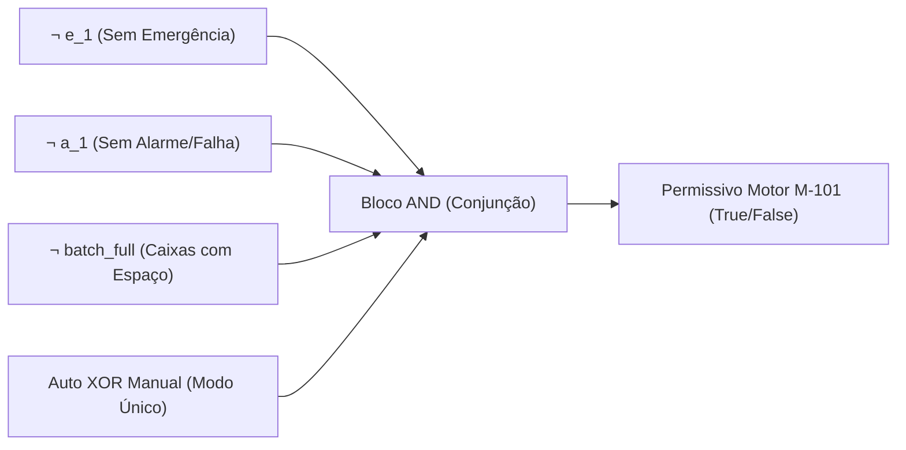

# Aula 04: Lógica Proposicional — Conectivos e Blocos de Permissivos

## 1. Fundamentos Matemáticos: Conectivos Lógicos

Na matemática discreta, uma **proposição** é uma sentença declarativa que assume um e apenas um valor-verdade: **Verdadeiro** ($1$) ou **Falso** ($0$).

As operações sobre variáveis proposicionais são definidas por operadores lógicos fundamentais:
1. **Negação ($
eg A$ ou $ar{A}$):** Inverte o valor-verdade da proposição.
2. **Conjunção ($A \land B$):** Verdadeira se e somente se ambos os operandos forem verdadeiros. Em automação, modela condições em **série** (intertravamento e permissivos conjuntos).
3. **Disjunção ($A \lor B$):** Verdadeira se ao menos um dos operandos for verdadeiro. Em automação, modela redundâncias ou condições em **paralelo** (múltiplas causas de falha).
4. **Disjunção Exclusiva ($A \oplus B$):** Verdadeira se exatamente um dos operandos for verdadeiro ($
eg(A \leftrightarrow B)$). Usada em seletores de modo operacional (Manual $\oplus$ Automático).
5. **Implicação / Condicional ($A 
ightarrow B$):** $
eg A \lor B$. Modela regras operacionais "SE condição $A$, ENTÃO ação $B$".
6. **Bicondicional ($A \leftrightarrow B$):** $(A 
ightarrow B) \land (B 
ightarrow A)$. Modela equivalência de estados operacionais.

---

## 2. Aplicação em Engenharia: Permissivos de Partida de Equipamentos Críticos

Em controle e automação, um **permissivo de partida** (*Start Permissive*) é uma condição booleana que deve ser estritamente satisfeita para que um atuador de potência (esteira, pistão de alimentação, braço pneumático) possa receber o comando de energização.

### 2.1. Permissivo da Esteira Principal ($P_{	ext{M-101}}$)

O motor da esteira principal $	ext{M-101}$ é responsável por transportar as peças do silo até as caixas de loteamento. Seu acionamento ($cmd_{	ext{M-101}}$) requer:

- Sem botão de parada de emergência ativo: $
eg e_1$
- Sistema sem alarmes ativos ou falhas: $
eg a_1$
- Nenhuma caixa de loteamento cheia (condição de parada solicitada): $
eg batch\_full$
- Modo operacional definido de forma única: $	ext{Auto} \oplus 	ext{Manual}$

$$P_{	ext{M-101}} \equiv 
eg e_1 \land 
eg a_1 \land 
eg batch\_full \land (	ext{Auto} \oplus 	ext{Manual})$$

### 2.2. Permissivo de Alimentação do Silo ($P_{	ext{XV-101}}$)

Para que o pistão pneumático de alimentação $	ext{XV-101}$ libere uma nova peça, a esteira já deve estar rodando e não pode haver congestionamento na saída:

- Motor da esteira principal ligado e confirmado: $m_1$
- Silo não está vazio: $
eg l_{silo}$
- Saída do alimentador está livre (sem peça presa): $
eg s_{feed}$
- Permissivo geral da esteira (M-101) verdadeiro: $P_{	ext{M-101}}$

$$P_{	ext{XV-101}} \equiv m_1 \land 
eg l_{silo} \land 
eg s_{feed} \land P_{	ext{M-101}}$$

### 2.3. Intertrava de Bloqueio Contínuo (Run Interlock)

Mesmo após a partida da esteira, se qualquer condição crítica falhar (como uma caixa encher ou alguém acionar o botão de emergência), a operação é imediatamente interrompida (Trip).

$$	ext{Trip}_{	ext{M-101}} \equiv e_1 \lor a_1 \lor batch\_full$$

Pelas Leis de De Morgan, podemos provar matematicamente que o bloqueio (Trip) é a negação exata das condições bases de permissão de partida:

$$	ext{Trip}_{	ext{M-101}} \equiv 
eg (
eg e_1 \land 
eg a_1 \land 
eg batch\_full) \equiv 
eg P_{	ext{M-101\_base}}$$
