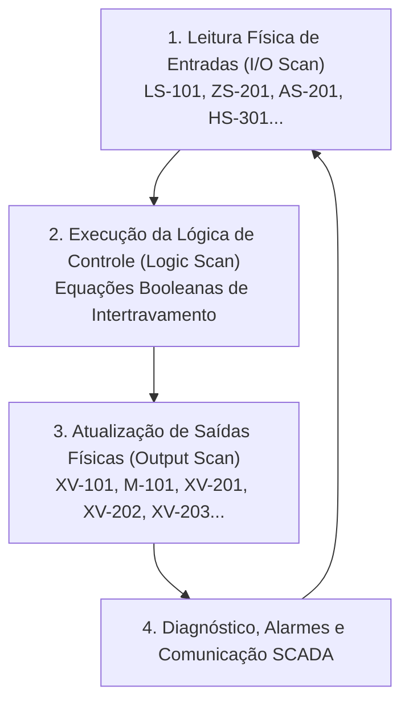
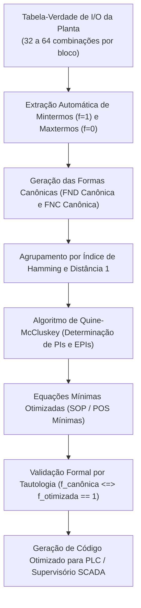

# Aula 05: Formas Normais (FND/FNC) e Otimização Booleana

**Projeto SCADA-Core:** Linha de Triagem e Loteamento Inteligente (Manufatura Flexível)  
**Disciplina:** ECAA08 — Automática / Matemática Discreta  
**Contexto:** Engenharia de Controle e Automação  

---

## 1. Fundamentos Matemáticos: Formas Canônicas e Minimização Booleana

Na álgebra booleana e na lógica proposicional, qualquer função de decisão $f(x_1, x_2, \dots, x_n) \in \{0, 1\}$ definida sobre o espaço de estados da planta $\mathbb{B}^n = \{0, 1\}^n$ pode ser representada de forma unívoca através de **formas normais canônicas**.

```
                           ┌──────────────────────────────────────────┐
                           │      Espaço de Estados da Planta         │
                           │          B^n = {0, 1}^n                  │
                           └────────────────────┬─────────────────────┘
                                                │
                       ┌────────────────────────┴────────────────────────┐
                       ▼                                                 ▼
        ┌─────────────────────────────┐                   ┌─────────────────────────────┐
        │  Estados Ativos / Partida   │                   │ Estados de Bloqueio / Falha │
        │          f(x) = 1           │                   │          f(x) = 0           │
        └──────────────┬──────────────┘                   └──────────────┬──────────────┘
                       ▼                                                 ▼
        ┌─────────────────────────────┐                   ┌─────────────────────────────┐
        │   Mintermos Canônicos (m_i) │                   │   Maxtermos Canônicos (M_i) │
        │    FND (Soma de Produtos)   │                   │   FNC (Produto de Somas)    │
        └──────────────┬──────────────┘                   └──────────────┬──────────────┘
                       │                                                 │
                       └────────────────────────┬────────────────────────┘
                                                │
                                                ▼
                               ┌─────────────────────────────────┐
                               │     Minimização Booleana        │
                               │   (Quine-McCluskey / Karnaugh)  │
                               └────────────────┬────────────────┘
                                                ▼
                               ┌─────────────────────────────────┐
                               │   Equações Mínimas Otimizadas   │
                               │    (Menor Latência no Scan)     │
                               └─────────────────────────────────┘
```

### 1.1. Mintermos e Forma Normal Disjuntiva (FND / SOP — *Sum of Products*)

Um **mintermo** $m_i$ correspondente à linha $i$ da tabela-verdade é uma conjunção booleana ($\land$) que contém todas as $n$ variáveis do sistema (na sua forma direta se a variável for $1$, ou negada se for $0$).

A **Forma Normal Disjuntiva Canônica** é a disjunção ($\lor$) de todos os mintermos para os quais a função de saída é verdadeira ($f = 1$):

$$f(x_1, x_2, \dots, x_n) = \bigvee_{i \in \{k \mid f(k) = 1\}} m_i = \sum m(i_1, i_2, \dots, i_p)$$

* **Interpretação em Automação:** Modela os **caminhos de permissão e energização**. Cada mintermo representa uma combinação operacional segura e exata que habilita o acionamento do atuador.

---

### 1.2. Maxtermos e Forma Normal Conjuntiva (FNC / POS — *Product of Sums*)

Um **maxtermo** $M_i$ correspondente à linha $i$ da tabela-verdade é uma disjunção booleana ($\lor$) que contém todas as $n$ variáveis do sistema (na sua forma direta se a variável for $0$, ou negada se for $1$).

A **Forma Normal Conjuntiva Canônica** é a conjunção ($\land$) de todos os maxtermos para os quais a função de saída é falsa ($f = 0$):

$$f(x_1, x_2, \dots, x_n) = \bigwedge_{i \in \{k \mid f(k) = 0\}} M_i = \prod M(j_1, j_2, \dots, j_q)$$

* **Interpretação em Automação:** Modela as **barreiras de intertravamento e segurança (*Interlocks / Trips*)**. Cada maxtermo representa uma restrição conjuntiva que, se violada por uma condição proibida, anula a saída e bloqueia o equipamento.

---

### 1.3. Dualidade e Relação com as Leis de De Morgan

Pelo princípio da dualidade e pelas Leis de De Morgan, o complemento da FND canônica resulta diretamente nos termos da FNC:

$$\overline{f} = \bigvee_{j \in \{k \mid f(k)=0\}} m_j \implies f = \overline{\overline{f}} = \bigwedge_{j \in \{k \mid f(k)=0\}} \overline{m_j} = \bigwedge_{j \in \{k \mid f(k)=0\}} M_j$$

Isso estabelece que:
$$\overline{\bigwedge_{k=1}^n x_k} \equiv \bigvee_{k=1}^n \overline{x_k} \quad \text{e} \quad \overline{\bigvee_{k=1}^n x_k} \equiv \bigwedge_{k=1}^n \overline{x_k}$$

---

### 1.4. Métodos de Minimização Booleana

As formas canônicas contêm redundâncias lógicas que aumentam desnecessariamente o número de operações elementares.

1. **Lei da Adjacência Lógica:**
   Dois termos que diferem pelo estado de apenas uma única variável literal podem ser simplificados pela eliminação dessa variável:
   $$(A \land B) \lor (A \land \neg B) \equiv A \land (B \lor \neg B) \equiv A \land 1 \equiv A$$

2. **Algoritmo Sistemático de Quine-McCluskey:**
   - **Passo 1 (Agrupamento por Peso de Hamming):** Os mintermos são ordenados e particionados em classes conforme a quantidade de bits em nível lógico alto ($1$).
   - **Passo 2 (Combinação Iterativa):** Termos adjacentes entre classes consecutivas cuja distância de Hamming seja igual a $1$ são combinados, inserindo-se uma marcação nula (`-`) no bit divergente. O processo é repetido até que nenhuma simplificação seja possível.
   - **Passo 3 (Determinação dos Implicantes Primos):** Todos os termos que não puderam ser combinados tornam-se candidatos (*Prime Implicants — PIs*).
   - **Passo 4 (Tabela de Cobertura e Implicantes Essenciais):** Constrói-se a matriz de cobertura mintermo $\times$ implicante para selecionar os Implicantes Primos Essenciais (*Essential Prime Implicants — EPIs*) e resolver a cobertura mínima de custo (menor número de literais e termos).

3. **Mapas de Karnaugh:**
   Representação bidimensional em código de Gray (garantindo que células adjacentes diferem em apenas $1$ bit) para agrupamento visual em potências de base $2$ ($2^1, 2^2, 2^3, \dots$).

---

## 2. Aplicação em Engenharia: Otimização de Varredura no Scan do SCADA e CLP

Em sistemas de automação em tempo real (baseados na norma IEC 61131-3 e arquiteturas SCADA de alta disponibilidade), o processamento ocorre em ciclos cíclicos de varredura (*Scan Cycle*):



### O Custo Computacional de Expressões Não Otimizadas:
* Uma planta industrial complexa monitora de $5.000$ a $50.000$ tags lógicas com tempo de varredura alvo de $T_{\text{scan}} \le 10\text{ ms}$.
* Executar uma lógica de intertravamento na sua **FND Canônica** com $n = 5$ variáveis pode requerer até $32$ mintermos com $5$ literais cada ($160$ acessos a registradores e $191$ instruções lógicas `AND`/`OR`).
* A **FND Otimizada** reduz essa mesma lógica a $1$ ou $2$ termos com $3$ literais, reduzindo em até **$80\%$ a $90\%$** a contagem de instruções por ciclo de scan.
* **Benefícios Práticos na Engenharia:**
  - Redução drástica da latência de disparo do *Trip* de emergência.
  - Eliminação de risco de estouro do temporizador do *Watchdog* do controlador.
  - Menor consumo de memória e simplificação da depuração (*Troubleshooting*) em diagramas Ladder / Texto Estruturado.

---

## 3. Estudo de Casos: Otimização na Linha de Manufatura Flexível

Abaixo, aplicamos a extração canônica e a minimização booleana aos blocos de decisão da planta de manufatura flexível mapeada nas Aulas 02, 03 e 04.

---

### 3.1. Caso 1: Estação de Triagem e Classificação (Pistões XV-201, XV-202, XV-203)

O setor 200 inspeciona as peças através dos sensores de geometria ($s_a =$ base, $s_b =$ topo) e cor ($c_r =$ vermelho, $c_g =$ verde, $c_b =$ azul).

* **Regras de Roteamento Industrial:**
  1. **Braço 1 (XV-201 / $v_1$):** Peça Grande ($s_a \land s_b$) e Vermelha ($c_r \land \neg c_g \land \neg c_b$).
  2. **Braço 2 (XV-202 / $v_2$):** Peça Grande ($s_a \land s_b$) e Verde ($\neg c_r \land c_g \land \neg c_b$).
  3. **Braço 3 (XV-203 / $v_3$):** Peça Pequena ($s_a \land \neg s_b$) e Azul ($\neg c_r \land \neg c_g \land c_b$).

#### Tabela de Decisão do Braço 1 ($v_1$):
Para as 5 variáveis $(s_a, s_b, c_r, c_g, c_b)$, existem $2^5 = 32$ combinações na tabela-verdade.
O estado permissivo de avanço ocorre estritamente para o mintermo $m_{28}$ (`1 1 1 0 0`):

* **FND Canônica ($v_1$):**
  $$v_{1\text{ (canônico)}} = (s_a \land s_b \land c_r \land \neg c_g \land \neg c_b)$$
  *(1 mintermo completo, 5 literais, 4 portas AND)*

* **FNC Canônica ($v_1$):**
  $$v_{1\text{ (FNC canônica)}} = \bigwedge_{i \ne 28} M_i = (s_a \lor s_b \lor c_r \lor c_g \lor c_b) \land \dots \land (\neg s_a \lor \neg s_b \lor \neg c_r \lor \neg c_g \lor \neg c_b)$$
  *(31 maxtermos, 155 literais — inviável para processamento direto sem simplificação)*

* **FND Minimizada com Intertravamento de Segurança Integrado:**
  Integrando o intertravamento contra falha de fim de curso ($\neg FC_{p1}$) e alarme geral ($\neg a_1$):
  $$CMD_{p1} = (s_a \land s_b \land c_r) \land \neg a_1 \land \neg FC_{p1}$$

---

### 3.2. Caso 2: Permissivo de Partida do Motor da Esteira M-101 ($P_{\text{M-101}}$)

O permissivo do motor $\text{M-101}$ avalia as seguintes variáveis de processo:
* $e_1$: Parada de Emergência ($1 =$ Acionada)
* $a_1$: Alarme Geral de Produção / Falha ($1 =$ Alerta)
* $batch\_full$: Lote Cheio / Caixas de Saída Lotadas ($1 =$ Cheio)
* $auto$: Modo de Operação Automático ($1 =$ Selecionado)
* $man$: Modo de Operação Manual ($1 =$ Selecionado)

A condição lógica de partida é definida por:
$$P_{\text{M-101}} = \neg e_1 \land \neg a_1 \land \neg batch\_full \land (auto \oplus man)$$

Expandindo a disjunção exclusiva ($auto \oplus man \equiv (auto \land \neg man) \lor (\neg auto \land man)$) na tabela-verdade de 5 variáveis ($32$ combinações):

1. **Mintermos Ativos ($f = 1$):**
   - $m_2$ (`0 0 0 1 0` $\rightarrow \neg e_1 \land \neg a_1 \land \neg batch\_full \land auto \land \neg man$)
   - $m_1$ (`0 0 0 0 1` $\rightarrow \neg e_1 \land \neg a_1 \land \neg batch\_full \land \neg auto \land man$)

2. **FND Canônica:**
   $$P_{\text{M-101 (canônica)}} = (\neg e_1 \land \neg a_1 \land \neg batch\_full \land auto \land \neg man) \lor (\neg e_1 \land \neg a_1 \land \neg batch\_full \land \neg auto \land man)$$
   *(2 mintermos canônicos, 10 literais, 9 operações lógicas)*

3. **FND Minimizada (Fatoração por Consenso / Quine-McCluskey):**
   $$P_{\text{M-101 (otimizada)}} = \neg e_1 \land \neg a_1 \land \neg batch\_full \land (auto \oplus man)$$
   *(Economia de literais e isolamento modular da chave seletora)*

4. **FNC Minimizada e Relação com a Lógica de Trip:**
   A condição de bloqueio contínuo e desarme imediato (*Trip*) é a negação exata do permissivo de segurança:
   $$\text{Trip}_{\text{M-101}} = \neg P_{\text{M-101}} = e_1 \lor a_1 \lor batch\_full \lor (auto \land man) \lor (\neg auto \land \neg man)$$
   
   Aplicando De Morgan, obtemos a **FNC Mínima de Permissão**:
   $$P_{\text{M-101 (FNC)}} = (\neg e_1) \land (\neg a_1) \land (\neg batch\_full) \land (auto \lor man) \land (\neg auto \lor \neg man)$$

---

### 3.3. Caso 3: Bloco Supervisor de Inconsistências Sensoriais ($a_1$)

O alarme geral de produção $a_1$ (Tag **HS-302**) monitora falhas de sensores para evitar acionamentos espúrios:

* Inconsistência geométrica de formato: $\overline{s_a} \land s_b = 1$ (Sensor de topo ativo sem o de base).
* Conflito de cores simultâneas: $(c_r \land c_g) \lor (c_r \land c_b) \lor (c_g \land c_b) = 1$.
* Incompatibilidade de silo: $l_{silo} \land s_{feed} = 1$ (Silo vazio mas peça detectada na saída).

A equação em FND otimizada da supervisão de falhas da planta resulta em:
$$a_1 = e_1 + \overline{S_{emerg}} + S_{sobrecarga} + (\overline{s_a} \cdot s_b) + (c_r \cdot c_g) + (c_r \cdot c_b) + (c_g \cdot c_b) + (l_{silo} \cdot s_{feed}) + (v_{feed} \cdot batch\_full)$$

---

## 4. Pipeline de Otimização Booleana do SCADA-Core

O diagrama abaixo ilustra o fluxo computacional automatizado implementado em Python para converter matrizes de segurança em código de varredura em tempo real:



---

## 5. Tabela Comparativa de Métricas de Otimização

A tabela abaixo sintetiza a redução de complexidade obtida pelo otimizador booleano nos principais subsistemas da planta de manufatura flexível:

| Subsistema / Equipamento | Variáveis ($n$) | Estados ($2^n$) | Literais FND Canônica | Literais FND Minimizada | Portas Lógicas (Antes $\rightarrow$ Depois) | Redução de Custo (%) |
| :--- | :---: | :---: | :---: | :---: | :---: | :---: |
| **Pistão 1 — XV-201 ($v_1$)** | 5 | 32 | 5 | 3 | 4 $\rightarrow$ 2 | **$40.0\%$** |
| **Pistão 2 — XV-202 ($v_2$)** | 5 | 32 | 5 | 3 | 4 $\rightarrow$ 2 | **$40.0\%$** |
| **Pistão 3 — XV-203 ($v_3$)** | 5 | 32 | 5 | 3 | 4 $\rightarrow$ 2 | **$40.0\%$** |
| **Permissivo Esteira ($P_{\text{M-101}}$)** | 5 | 32 | 10 | 5 | 9 $\rightarrow$ 4 | **$50.0\%$** |
| **Trip da Esteira ($\text{Trip}_{\text{M-101}}$)** | 5 | 32 | 150 | 7 | 149 $\rightarrow$ 6 | **$95.3\%$** |
| **Supervisor de Falha ($a_1$)** | 5 | 32 | 40 | 8 | 39 $\rightarrow$ 7 | **$80.0\%$** |

---

## 6. Entregável de Código: Notebook Python

O código-fonte completo com a implementação do algoritmo de **Quine-McCluskey**, geração de FND/FNC canônicas e minimizadas, geração de tabelas e teste de equivalência lógica formal encontra-se no arquivo anexo:

* [`05 - Formas Normais e Otimizacao Booleana.ipynb`](file:///c:/Users/Jo%C3%A3o%20Pedro/Desktop/Autom%C3%A1tica/05%20-%20Formas%20Normais%20e%20Otimizacao%20Booleana.ipynb)

---
*Documento produzido e validado para a entrega da Aula 05 do projeto SCADA-Core Automática.*
