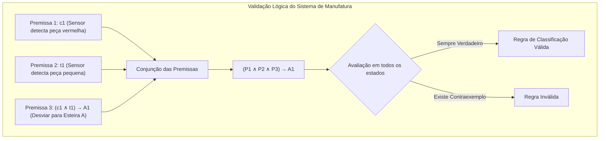

# Aula 07: Validade de Argumentos e Inferência Lógica em Sistemas de Manufatura Flexível

## 1. Fundamentos Matemáticos: Argumentos Dedutivos, Validade e Tautologias

Em sistemas de manufatura flexível (*Flexible Manufacturing Systems – FMS*), a tomada de decisão automática depende da correta interpretação dos sinais dos sensores e da execução de ações pelos atuadores.

Para garantir que o sistema opere corretamente, é necessário verificar se as regras de decisão são **logicamente válidas**.

### 1.1. Definição Formal de Argumento e Validade

Um argumento dedutivo é composto por um conjunto de premissas e uma conclusão:

$$
P_1, P_2, ..., P_k \vdash C
$$

O argumento é considerado válido quando não existe situação em que todas as premissas sejam verdadeiras e a conclusão seja falsa.

Pela equivalência fundamental:

$$
\{P_1,P_2,...,P_k\}\models C
\iff
(P_1 \land P_2 \land ... \land P_k)\rightarrow C
\equiv T
$$

---

## 2. Regras Canônicas de Inferência Aplicadas à Manufatura Flexível

| Regra | Esquema Formal | Aplicação na Manufatura |
|---------|---------|---------|
| Modus Ponens | P→Q, P ⊢ Q | Se a peça for vermelha, enviar para Esteira A. A peça é vermelha. Portanto, enviar para Esteira A. |
| Modus Tollens | P→Q, ¬Q ⊢ ¬P | Se a peça passou pelo sensor de saída, então estará registrada no contador. Não está registrada. Logo, não passou pelo sensor. |
| Silogismo Hipotético | P→Q, Q→R ⊢ P→R | Se a peça é metálica, vai para inspeção. Se vai para inspeção, recebe etiqueta. Logo, peça metálica recebe etiqueta. |
| Silogismo Disjuntivo | P∨Q, ¬P ⊢ Q | A peça irá para o Depósito A ou B. Não foi para o A. Logo, foi para o B. |
| Resolução | P∨Q, ¬P∨R ⊢ Q∨R | Utilizada para simplificação das regras de classificação da célula. |
| Dilema Construtivo | (P→Q) ∧ (R→S), P∨R ⊢ Q∨S | Se peça vermelha, enviar à Esteira A. Se peça azul, enviar à Esteira B. Detectou vermelha ou azul. Logo, enviar à Esteira A ou B. |

---

## 3. Teorema da Refutação e Prova por Contradição

A validade de uma regra de classificação pode ser verificada por refutação.

Considere a regra:

$$
(c1 \land t1)\rightarrow A1
$$

onde:

- c1 = peça vermelha
- t1 = peça pequena
- A1 = desviar para Esteira A

A validade é comprovada verificando se:

$$
\{c1,t1,(c1 \land t1)\rightarrow A1,\neg A1\}
$$

gera uma contradição.

---

## 4. Falácias Formais em Sistemas de Classificação

### 4.1 Afirmação do Consequente

$$
P\rightarrow Q,\;Q\not\vdash P
$$

Exemplo incorreto:

- Se a peça é vermelha, ela vai para a Esteira A.
- A peça foi para a Esteira A.
- Portanto, ela é vermelha.

### 4.2 Negação do Antecedente

$$
P\rightarrow Q,\;\neg P\not\vdash \neg Q
$$

Exemplo incorreto:

- Se a peça é metálica, vai para inspeção.
- A peça não é metálica.
- Portanto, não vai para inspeção.

---

## 5. Aplicação na Célula de Manufatura Flexível

| Variável | Significado |
|-----------|-----------|
| c1 | Peça vermelha detectada |
| c2 | Peça azul detectada |
| t1 | Peça pequena |
| t2 | Peça grande |
| m1 | Peça metálica |
| A1 | Desviar para Esteira A |
| A2 | Desviar para Esteira B |
| INS | Enviar para inspeção |
| EST | Armazenar peça |

Exemplos de regras:

$$
(c1 \land t1)\rightarrow A1
$$

$$
(c2 \land t2)\rightarrow A2
$$

$$
m1 \rightarrow INS
$$

$$
(A1 \lor A2)\rightarrow EST
$$

---

## 6. Entregável da Aula 07

**Módulo `ValidadorLogicoManufaturaFlexivel` em Python**

1. Verificador de validade por Tabela-Verdade.
2. Verificador por Refutação e Contradição.
3. Implementação das regras:
   - Modus Ponens
   - Modus Tollens
   - Silogismo Hipotético
   - Silogismo Disjuntivo
   - Resolução
4. Testes automatizados utilizando regras reais de classificação de peças da célula de manufatura.
5. Demonstração de falácias lógicas e seus impactos na automação industrial.
