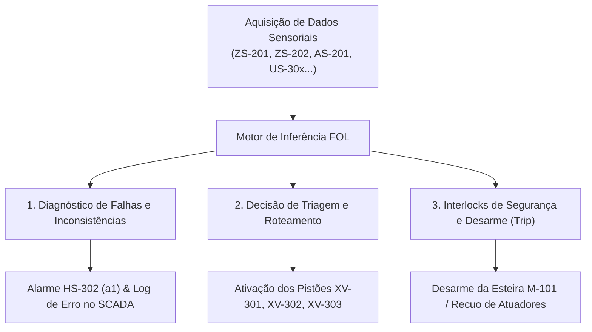

# Aula 06 & 07: Lógica de Predicados, Regras de Inferência e Sistema Especialista

**Projeto SCADA-Core:** Linha de Triagem e Loteamento Inteligente (Manufatura Flexível)  
**Disciplina:** ECAA08 — Matemática Discreta / Automática  
**Contexto:** Engenharia de Controle e Automação  

---

## 1. Fundamentos Matemáticos: Lógica de Primeira Ordem (FOL) e Sistemas Baseados em Regras

A **Lógica de Predicados de Primeira Ordem (FOL — *First-Order Logic*)** estende o cálculo proposicional permitindo parametrizar relações e propriedades sobre conjuntos finitos de ativos e sinais da Célula de Manufatura Flexível.

### 1.1. Definição Formal de Predicados e Quantificadores
1. **Predicado $P(x)$:** Função booleana $P: \mathcal{U} 
ightarrow \{0, 1\}$, onde $\mathcal{U}$ representa o universo de discurso.
2. **Quantificador Universal ($orall x \in \mathcal{U}, P(x)$):**
   $$orall x \in \mathcal{U}, P(x) \equiv igwedge_{i=1}^n P(x_i) = P(x_1) \land P(x_2) \land \dots \land P(x_n)$$
3. **Quantificador Existencial ($\exists x \in \mathcal{U}, P(x)$):**
   $$\exists x \in \mathcal{U}, P(x) \equiv igvee_{i=1}^n P(x_i) = P(x_1) \lor P(x_2) \lor \dots \lor P(x_n)$$

### 1.2. Regras de Produção e Inferência Dedutiva
A base de regras do sistema especialista adota a forma canônica condicional:
$$	ext{SE } \langle	ext{Antecedente / Premissas}
angle 	ext{ ENTÃO } \langle	ext{Consequente / Ação}
angle$$

Pelo esquema formal de **Modus Ponens** ($P 
ightarrow Q, P dash Q$), o motor de inferência dispara diagnósticos e ações de controle no SCADA quando as premissas sensoriais são satisfeitas.

---

## 2. Universos de Discurso ($\mathcal{U}$) e Mapeamento de Tags (P&ID)

Com base no diagrama P&ID e na arquitetura do sistema, definem-se os seguintes domínios finitos:

* **Motores de Transporte ($M_{	ext{esteiras}}$):**
  $$M_{	ext{esteiras}} = \{	ext{M-101}, 	ext{M-301}, 	ext{M-302}, 	ext{M-303}\}$$
* **Atuadores Pneumáticos de Triagem e Alimentação ($A_{	ext{atuadores}}$):**
  $$A_{	ext{atuadores}} = \{	ext{XV-101}, 	ext{XV-301}, 	ext{XV-302}, 	ext{XV-303}\}$$
* **Instrumentação de Loteamento / Barreiras Ópticas ($S_{	ext{contagem}}$):**
  $$S_{	ext{contagem}} = \{	ext{US-301}, 	ext{US-302}, 	ext{US-303}\}$$
* **Instrumentação de Inspeção e Sensoriamento ($S_{	ext{inspecao}}$):**
  $$S_{	ext{inspecao}} = \{	ext{ZS-101}, 	ext{ZS-201}, 	ext{ZS-202}, 	ext{AS-201}, 	ext{LS-101}\}$$
* **Caixas de Loteamento ($C_{	ext{lotes}}$):**
  $$C_{	ext{lotes}} = \{	ext{Caixa}_1, 	ext{Caixa}_2, 	ext{Caixa}_3\}$$
* **Peças em Trânsito na Linha ($\mathcal{P}$):**
  $$\mathcal{P} = \{p_1, p_2, \dots, p_k\}$$

---

## 3. Dicionário de Predicados da Célula

| Predicado FOL | Significado Físico / Tag Associada | Tipo |
| :--- | :--- | :--- |
| $	ext{Base}(p)$ | Sensor $	ext{ZS-201} = 1$ (Peça $p$ presente na base do túnel) | Sensoriamento |
| $	ext{Topo}(p)$ | Sensor $	ext{ZS-202} = 1$ (Peça $p$ possui altura de formato grande) | Sensoriamento |
| $	ext{Cor}(p, c)$ | Sensor $	ext{AS-201}$ detecta canal de cor $c \in \{	ext{Vermelho}, 	ext{Verde}, 	ext{Azul}\}$ | Sensoriamento |
| $	ext{SiloVazio}()$ | Sensor de nível $	ext{LS-101} = 1$ (Silo sem material) | Sensoriamento |
| $	ext{PecaNaSaida}()$ | Sensor de posição $	ext{ZS-101} = 1$ (Peça liberada na saída do alimentador) | Sensoriamento |
| $	ext{FimDeCurso}(a)$ | Sensor de avanço do cilindro pneumático $a$ ativado | Sensoriamento |
| $	ext{Contagem}(c, n)$ | Sensor $	ext{US-30x}$ registrou $n$ unidades na caixa $c$ | Estado |
| $	ext{CaixaCheia}(c)$ | $	ext{Contagem}(c, 10)$ (Lote de 10 peças concluído) | Estado |
| $	ext{TransbordoGeral}()$ | $orall s \in S_{	ext{contagem}}, 	ext{CaixaCheia}(s)$ (Todas as 3 caixas lotadas) | Diagnóstico |
| $	ext{Emergencia}()$ | Botão de emergência $	ext{HS-301} = 1$ ou $S_{	ext{emerg}} = 0$ | Segurança |
| $	ext{Sobrecarga}(m)$ | Sensor térmico do motor $m$ em nível alto | Segurança |
| $	ext{Falha}(x)$ | Ativo ou sensor $x$ em regime de falha / inconsistência | Diagnóstico |

---

## 4. Base de Regras do Sistema Especialista (SE ... ENTÃO)

---

### 4.1. Regras de Diagnóstico de Falhas e Inconsistências (Alarmes do SCADA)

* **Regra R-DIAG-01 (Inconsistência Geométrica de Formato):**
  $$orall p \in \mathcal{P}, \, (
eg 	ext{Base}(p) \land 	ext{Topo}(p)) \implies 	ext{Falha}(	ext{ZS-201}) \land 	ext{DispararAlarme}(a_1)$$
  * **Regra:** **SE** o sensor de topo $	ext{ZS-202}$ for ativado sem o sensor de base $	ext{ZS-201}$, **ENTÃO** diagnosticar peça desalinhada/falha de leitura óptica e disparar o alarme geral $a_1$ ($	ext{HS-302}$).

* **Regra R-DIAG-02 (Ambiguidade Óptica no Espectro de Cor):**
  $$orall p \in \mathcal{P}, \, ((	ext{Cor}(p, 	ext{Vermelho}) \land 	ext{Cor}(p, 	ext{Verde})) \lor (	ext{Cor}(p, 	ext{Vermelho}) \land 	ext{Cor}(p, 	ext{Azul})) \lor (	ext{Cor}(p, 	ext{Verde}) \land 	ext{Cor}(p, 	ext{Azul}))) \implies 	ext{Falha}(	ext{AS-201}) \land 	ext{DispararAlarme}(a_1)$$
  * **Regra:** **SE** dois ou mais canais de cor forem ativados simultaneamente na inspeção, **ENTÃO** registrar erro de calibração do sensor $	ext{AS-201}$, inibir a triagem e acionar o alarme $a_1$.

* **Regra R-DIAG-03 (Incompatibilidade no Silo de Alimentação):**
  $$	ext{SiloVazio}() \land 	ext{PecaNaSaida}() \implies 	ext{Falha}(	ext{ZS-101}) \land 	ext{DispararAlarme}(a_1)$$
  * **Regra:** **SE** o sensor $	ext{LS-101}$ indicar silo vazio mas o sensor $	ext{ZS-101}$ registrar presença de peça, **ENTÃO** registrar inconsistência no setor de alimentação e disparar o alarme $a_1$.

* **Regra R-DIAG-04 (Pistão Travado / Timeout de Atuação):**
  $$orall a \in A_{	ext{atuadores}}, \, (	ext{Comando}(a) \land 
eg 	ext{FimDeCurso}(a) \land 	ext{Timeout}(a)) \implies 	ext{FalhaMecanica}(a) \land 	ext{DispararAlarme}(a_1)$$
  * **Regra:** **SE** o comando de avanço for enviado ao pistão $a$ e o sensor de fim de curso não responder dentro do tempo limite, **ENTÃO** diagnosticar travamento mecânico do atuador e disparar alarme $a_1$.

---

### 4.2. Regras de Triagem, Classificação e Roteamento de Peças

* **Regra R-TRI-01 (Acionamento do Braço 1 — Válvula XV-301):**
  $$orall p \in \mathcal{P}, \, (	ext{Base}(p) \land 	ext{Topo}(p) \land 	ext{Cor}(p, 	ext{Vermelho}) \land 
eg 	ext{CaixaCheia}(	ext{Caixa}_1) \land 
eg 	ext{Emergencia}()) \implies 	ext{Acionar}(	ext{XV-301})$$
  * **Regra:** **SE** a peça for Grande ($	ext{ZS-201} \land 	ext{ZS-202}$), de cor Vermelha, a Caixa 1 tiver espaço disponível ($	ext{US-301} < 10$) e não houver emergência, **ENTÃO** avançar o Braço Empurrador 1 ($	ext{XV-301}$).

* **Regra R-TRI-02 (Acionamento do Braço 2 — Válvula XV-302):**
  $$orall p \in \mathcal{P}, \, (	ext{Base}(p) \land 	ext{Topo}(p) \land 	ext{Cor}(p, 	ext{Verde}) \land 
eg 	ext{CaixaCheia}(	ext{Caixa}_2) \land 
eg 	ext{Emergencia}()) \implies 	ext{Acionar}(	ext{XV-302})$$
  * **Regra:** **SE** a peça for Grande ($	ext{ZS-201} \land 	ext{ZS-202}$), de cor Verde, a Caixa 2 tiver espaço disponível ($	ext{US-302} < 10$) e não houver emergência, **ENTÃO** avançar o Braço Empurrador 2 ($	ext{XV-302}$).

* **Regra R-TRI-03 (Acionamento do Braço 3 — Válvula XV-303):**
  $$orall p \in \mathcal{P}, \, (	ext{Base}(p) \land 
eg 	ext{Topo}(p) \land 	ext{Cor}(p, 	ext{Azul}) \land 
eg 	ext{CaixaCheia}(	ext{Caixa}_3) \land 
eg 	ext{Emergencia}()) \implies 	ext{Acionar}(	ext{XV-303})$$
  * **Regra:** **SE** a peça for Pequena ($	ext{ZS-201} \land 
eg 	ext{ZS-202}$), de cor Azul, a Caixa 3 tiver espaço disponível ($	ext{US-303} < 10$) e não houver emergência, **ENTÃO** avançar o Braço Empurrador 3 ($	ext{XV-303}$).

---

### 4.3. Regras de Loteamento e Intertravamento de Segurança (Trip)

* **Regra R-LOT-01 (Conclusão de Lote de Expedição):**
  $$orall c \in C_{	ext{lotes}}, \, (	ext{Contagem}(c, 10) \implies 	ext{AlertaIntervencao}(c) \land 	ext{BloquearRoteamento}(c))$$
  * **Regra:** **SE** o contador óptico $	ext{US-30x}$ atingir 10 peças, **ENTÃO** sinalizar no SCADA a mensagem *"Caixa Cheia — Intervenção Necessária"* e bloquear novos desvios para a respectiva esteira secundária.

* **Regra R-SEC-01 (Desarme Geral / Trip da Esteira M-101):**
  $$	ext{Emergencia}() \lor (\exists m \in M_{	ext{esteiras}}, 	ext{Sobrecarga}(m)) \lor 	ext{TransbordoGeral}() \implies 	ext{DesligarMotor}(	ext{M-101}) \land orall a \in A_{	ext{atuadores}}, 	ext{Recuar}(a)$$
  * **Regra:** **SE** o botão de emergência $	ext{HS-301}$ for acionado, qualquer motor entrar em sobrecarga ou todas as três caixas atingirem capacidade máxima, **ENTÃO** desligar imediatamente o motor da esteira principal $	ext{M-101}$ e recuar todos os pistões pneumáticos.

---

## 5. Matriz Resumo do Sistema Especialista

| ID da Regra | Tipo de Regra | Expressão em Lógica de Predicados (FOL) | Conclusão / Ação no SCADA | Severidade |
| :--- | :--- | :--- | :--- | :--- |
| **R-DIAG-01** | Diagnóstico | $orall p, \, (
eg 	ext{Base}(p) \land 	ext{Topo}(p))$ | Falha Geometria $
ightarrow$ Descarte + Alarme $a_1$ | Alta |
| **R-DIAG-02** | Diagnóstico | $orall p, \, \exists c_1, c_2 \, (c_1 
eq c_2 \land 	ext{Cor}(p, c_1) \land 	ext{Cor}(p, c_2))$ | Conflito de Cor $
ightarrow$ Inibe Triagem + Alarme $a_1$ | Alta |
| **R-DIAG-03** | Diagnóstico | $	ext{SiloVazio}() \land 	ext{PecaNaSaida}()$ | Inconsistência de Silo $
ightarrow$ Alarme $a_1$ | Alta |
| **R-DIAG-04** | Diagnóstico | $orall a, \, (	ext{CMD}(a) \land 
eg 	ext{FC}(a) \land 	ext{Timeout}(a))$ | Cilindro Travado $
ightarrow$ Trip Imediato | Crítica |
| **R-TRI-01** | Roteamento | $orall p, \, (	ext{Grande}(p) \land 	ext{Vermelho}(p) \land 
eg 	ext{CaixaCheia}(	ext{Caixa}_1))$ | Energizar Válvula $	ext{XV-301}$ | Operacional |
| **R-TRI-02** | Roteamento | $orall p, \, (	ext{Grande}(p) \land 	ext{Verde}(p) \land 
eg 	ext{CaixaCheia}(	ext{Caixa}_2))$ | Energizar Válvula $	ext{XV-302}$ | Operacional |
| **R-TRI-03** | Roteamento | $orall p, \, (	ext{Pequeno}(p) \land 	ext{Azul}(p) \land 
eg 	ext{CaixaCheia}(	ext{Caixa}_3))$ | Energizar Válvula $	ext{XV-303}$ | Operacional |
| **R-LOT-01** | Loteamento | $orall s \in S_{	ext{contagem}}, \, (	ext{Valor}(s) \ge 10)$ | Sinalizar *"Caixa Cheia"* no Supervisório | Média |
| **R-SEC-01** | Segurança | $	ext{Emergencia}() \lor (\exists m, 	ext{Sobrecarga}(m)) \lor 	ext{TransbordoGeral}()$ | Trip / Desarme Geral do Motor $	ext{M-101}$ | Emergência |
